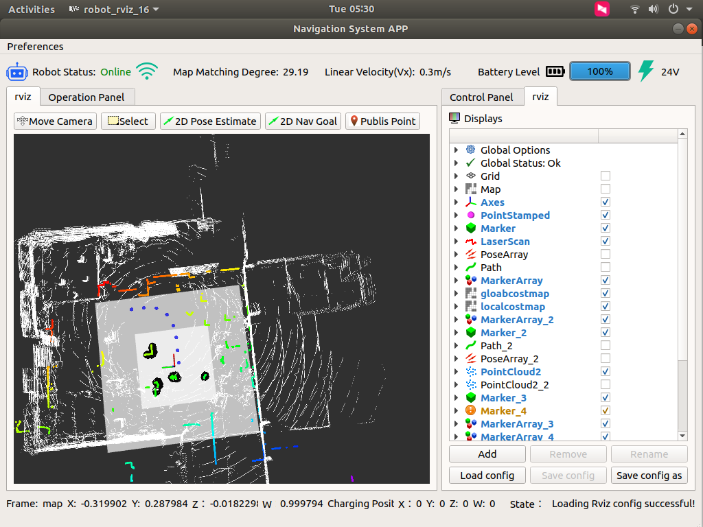
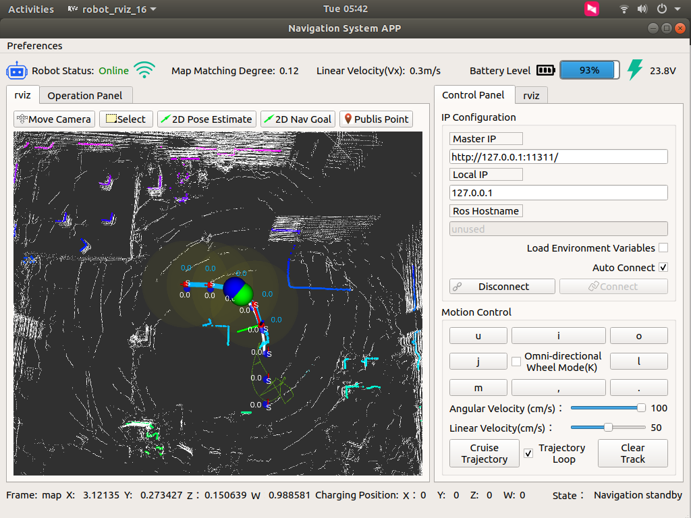

# 🚗 Autoware 3D SLAM & Navigation

This section introduces the full workflow for RobiX/RobiS robots using the **Autoware open-source autonomous driving framework** with 3D LiDAR SLAM, waypoint recording, and cruise control.

---

## 1. Launch the Autoware Navigation Stack

```bash
roslaunch ros_robot_control ros_robot_control.launch
```

---

## 2. Start the RViz-Based Navigation GUI

```bash
rosrun robot_rviz_16 robot_rviz_16
```

---

## 3. Configure RViz Display Parameters
   <p align="center">
   
   </p>
Use the following config file:
```
~/catkin_ws/src/slam_app/ros_qt5_gui_app_rviz_16_en/default.yaml
```
   <p align="center">
   
   </p>
---

## 4. Connect to Upper Computer

- Default main node: `127.0.0.1`
- Local IP: `127.0.0.1`
- Click **Connect**
- If failed, restart the upper computer and try again
   <p align="center">
   
   </p>
---

## 5. Start Point Cloud Recording

Click **Start Pointclouds Record** in the interface and drive the robot using the remote.

> ⚠️ Do not reverse or use erratic patterns like S-turns. Maintain a smooth and forward-only path.

Once done, stop recording.

---

## 6. Start Trajectory Recording (Waypoint Saver)

### Option 1 — via RViz (not recommended):
Use **Publish Point** to draw points manually.

### Option 2 — preferred:
After finishing point cloud recording, click **Start Trajectory Recording**. The recorded path will reflect actual movement and is fully drivable.

---

## 7. Start Mapping + Trajectory Recording Together

1. Click **Start Trajectory Recording**
2. Then click **Start Mapping**
3. Wait until terminal output finishes (Duration stops updating)
4. Stop recording — mapping completes automatically
   <p align="center">
   
   </p>
---

## 8. Activate Navigation

1. Drive the robot to the **initial point** used during point cloud recording
2. Click **Start Navigation**
3. Switch to RViz tab
4. Wait for map to load
   <p align="center">
   
   </p>
If positioning seems off, use **2D Pose Estimate** in RViz to manually align.

---

## 9. Enable Trajectory Cruise

1. Navigate to **Status** tab
2. Click **Enable Trajectory Cruise**

Behavior:
- Robot follows the path
- Stops at the endpoint
- If clicked again, will reverse the path

> 💡 If started at endpoint, the robot will go: `end -> start -> end`

If **trajectory loop** is enabled, the car will loop:
```
start → end → U-turn → end → start → U-turn → ...
```

Ensure enough space for U-turns.
   <p align="center">
   
   </p>
---

## 10. Start Waypoint Follower

> ⚠️ Robot will **start immediately** when this mode is activated.
   <p align="center">
   
   </p>
- Set the robot to remote control mode first
- Ensure safety and environment clearance
- Press emergency stop if needed

> ❗ Navigation and tracking modes cannot run at the same time. Turn off navigation first.

Use **2D Pose Estimate** to initialize pose if needed.

### Obstacle Handling
   <p align="center">
   
   </p>
- Robot stops for obstacles only in the **red box detection zone**
- Obstacle must not be too close (<0.2m blind zone)
- Robot resumes 2 seconds after the obstacle moves away