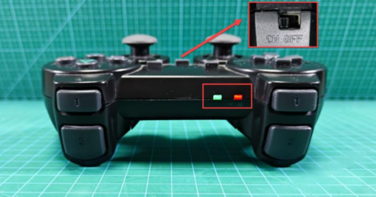

# 🎮 Remote Control Setup for RobiS Robot

This section describes how to use the remote controller to operate your RobiS robot.
Remote control system includes a onboard receiver and a PS2 joystick remote controller, they both have red and green indicator lights. 

The joystick button description

## 🔌 Step-by-Step Instructions

**Power On**  
   
   Turn on the robot by pressing the power button.

**Switch on the controller**
   

   
   

   

   
   

Both solid red and green lights indicate a successful connection.

 

**Unlock Remote Control Mode**  
   

   
   

   Every time after turning on the robot power, remote control needs to be unlocked.
   - Press the `Mode` button.
   - Then press `START` to activate remote control mode.

**Controls Overview**

| Button/Joystick     | Function                                 |
|---------------------|------------------------------------------|
| Mode                | Wake up / exit sleep                     |
| START               | Enter remote control mode                |
| Left joystick       | Move robot forward/backward              |
| Right joystick      | Rotate robot left/right                  |
| L1                  | Increase speed (max 1.5 m/s)             |
| L2                  | Decrease speed (min 0)                   |
| Remote Indicator    | Flashing = pairing, Solid = connected    |

> 💡 Other buttons currently have no assigned function.

## 🛑 Sleep Mode

- If unused for 5 minutes, the controller enters sleep.
- To wake it up, press the **Mode** button then press **Start** to unlock.

## ⚠️ Usage Precautions

- Ensure the remote controller receiver is plugged into the robot.
- Install batteries with correct polarity.
- When using multiple robots, match them **one-by-one** to avoid cross-control.