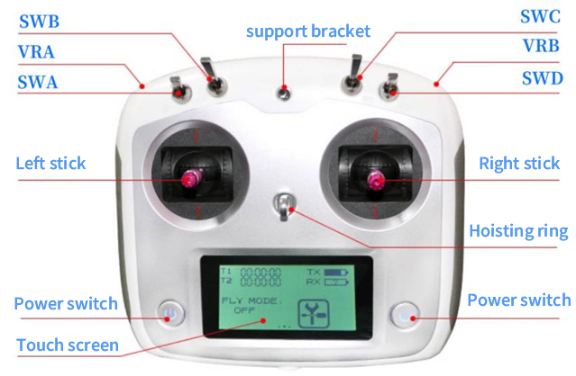

# 🎮 Remote Control Setup for RobiX Robot

##  Remote-Control Quick Guide

### ⚠️ Safety Notes
1. **First-use check**:  
   - After unboxing, raise the chassis so all wheels are off the ground.  
   - Power on, press the red e-stop and verify it cuts motor drive.  
   - Only lower the chassis when no abnormal noise or vibration is heard.
2. **Charging**:  
   - Shut the chassis down, press the e-stop, and use only the supplied charger.
3. **Crowded / tight spaces**:  
   - Select low-speed gear before moving.
4. **First stick movement after unlocking**:  
   - Move the **right stick LEFT / RIGHT only** (differential turn) to confirm response.  
   - Only then push the stick forward / backward.

   
   

---

### 🕹️ Basic Operation
| **Stick / Switch**           | **Function**   | **Description**                                              |
| ---------------------------- | -------------- | ------------------------------------------------------------ |
| **Left stick ↑**             | Forward        | Drive forward                                                |
| **Left stick ↓**             | Backward       | Drive backward                                               |
| **Right stick ←**            | Turn left      | Differential left turn                                       |
| **Right stick →**            | Turn right     | Differential right turn                                      |
| **SWB (up · middle · down)** | Control source | **Up**: None (auto-charge on dock-capable units)   **Middle**: PC / autopilot   **Down**: Radio control |
| **SWA (up · down)**          | Speed limit    | **Up**: Full speed   **Down**: Half speed                 |
| **SWC (any)**                | —              | No function                                                  |
| **SWD (up · down)**          | Emergency stop | **Up**: Activate e-stop   **Down**: Release e-stop        |
| **Power buttons**            | TX power       | Long-press **both** to turn remote on / off                  |
| **VRA / VRB**                | —              | No function                                                  |

---

### 🔧 Bumper & Audible Alerts
- **Bumper triggered** → press & release red e-stop **or** toggle SWD ↑ then ↓ to resume.  
- **Continuous beep** after power-on idle → jog any stick or power-cycle; also check battery level.

Keep SWA–D in the **down** position for safe manual driving.