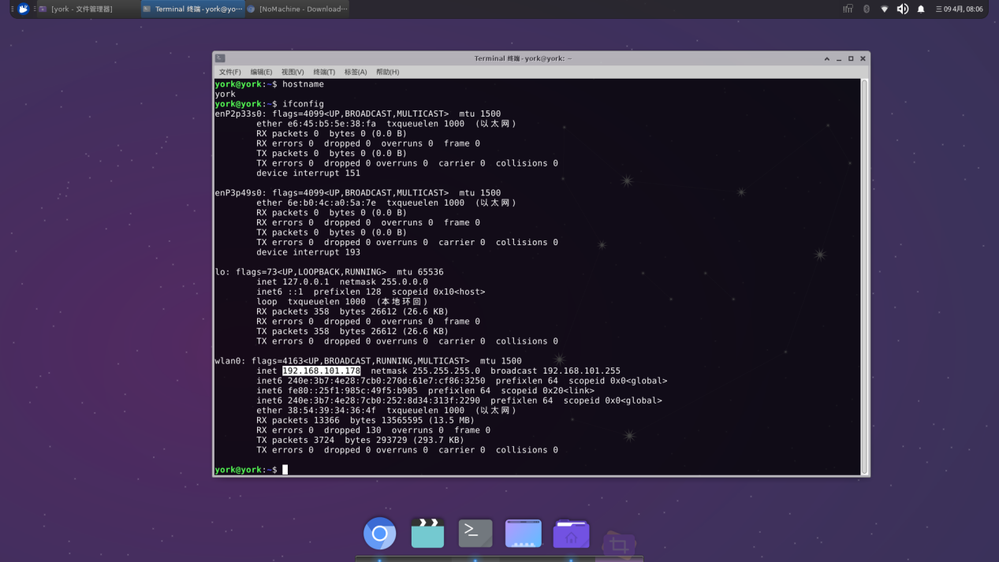

# 🖥️ Remote Login (NoMachine)

Remotely access the RobiX robot using the built-in NoMachine server.

## ✅ Default Credentials

- **Username**: `robify`
- **Password**: `robify1234` (also used for `sudo`)

---

## 🔗 Standard Connection Steps

1. Install NoMachine on your computer:  
   [https://downloads.nomachine.com/](https://downloads.nomachine.com/)
   <p align="center">
   
   </p>
2. Skip the corresponding operation steps according to the instructions, check them, and click OK in sequence.
   <p align="center">
   
   </p>
3. The navigation car is equipped with the corresponding NoMachine remote software (Arm8 architecture) at the factory. When the car is connected to the same LAN as the computer (mandatory), the SSH service of the current York car will be automatically displayed on the following interface. Double click to proceed.
   <p align="center">
   
   </p>

4. Next, if you reinstall the NoMachine server, confirm to regenerate the SSL certificate, and select `OK`. Not skipped.
   <p align="center">
   
   </p>

5. Login with: Username: `robify`   Password: `robify1234`
   <p align="center">
   
   </p>

6. Then you will see some tutorial instructions for some tools, skip the corresponding operation steps according to the instructions, check them, click `OK` in sequence, and wait to enter the system.
   <p align="center">
   
   </p>


---

## ❗ Troubleshooting

### Issue: Multiple Robots Detected

1. Click **Edit Connection**
   <p align="center">
   
   </p>
2. Set correct IP manually. Port: `4000`, Protocol: `NX`
   <p align="center">
   
   </p>
3. Use `ifconfig` on the robot to check IP address.
   <p align="center">
   
   </p>
4. After switching IP, connecting again will prompt for IP address change. Select `[OK]`
   <p align="center">
   
   </p>
### Issue: Certificate Expired
   <p align="center">
   
   </p>
Reinstall NoMachine on the robot:

```bash
sudo apt-get remove nomachine-enterprise-desktop
sudo dpkg -i nomachine_8.16.1_1_arm64.deb
```

Make sure the `.deb` file is in the correct directory.

---

> 🧠 Tip: If the touch screen is unresponsive on first login, press Enter before typing the password.

<!-- !!! tip "Quick Tip"
    Use `roslaunch robot_start robot_start.launch` to start all drivers at once.

!!! warning "Battery Warning"
    Always disconnect the battery when servicing the robot.

!!! note "Controller Sleep Mode"
    The PS2 controller enters sleep after 5 minutes of inactivity.

!!! info
    NoMachine requires the robot and your PC to be on the **same LAN**. -->
