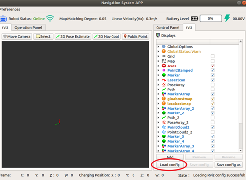
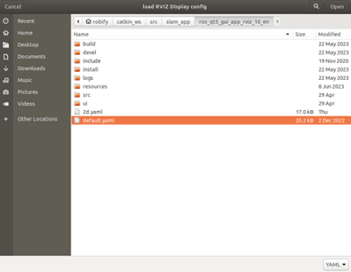
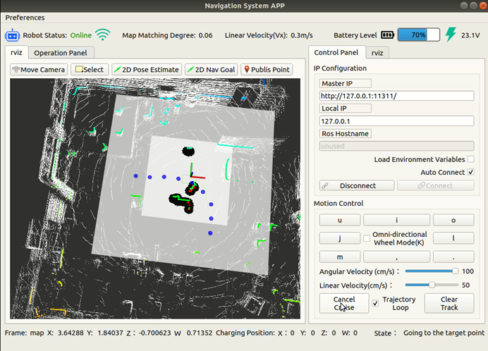

# 🗺️ Autoware 3D Slam 


---

## 🚀 Launch Autoware core

```
roslaunch ros_robot_control ros_robot_control.launch
```

## 🖥️ Start the upper-computer GUI

```
rosrun robot_rviz_16 robot_rviz_16
```

## ⚙️ Load RViz preset

<p align="center">
   
   </p>

Select:

```
catkin_ws/src/slam_app/ros_qt5_gui_app_rviz_16_en/default.yaml
```

<p align="center">
   
   </p>

## 🔗 Connect (auto by default)

Master IP: `127.0.0.1` Local IP: `127.0.0.1`
Click **Connect**; if it fails, restart the GUI.

<p align="center">
   
   </p>

## 📹 Record point-clouds

Press **Pointclouds Record**, then drive once around the desired area **(no reversing / sharp S-curves)**.
When finished, press **Stop Record** and remember the start pose.

## 📍 Record trajectory (Waypoint Saver)

After point-cloud recording, press **Waypoint Saver** to store the drivable path.

## 🗺️ Build map & save waypoints

1. Start **Waypoint Saver**

2. Press **Mapping**

3. Wait until terminal output stops (Duration finished)

4. Stop **Waypoint Saver** (mapping stops automatically)

   <p align="center">
      
      </p>

## 🧭 Start Navigation

Drive back to the **original start pose**.
Press **Navigation**, switch to **RViz** tab and wait for the map.
If localization drifts, set initial pose with **2D Pose Estimate** and drive a short distance to trigger re-localization (color points ≈ white map).
Send a goal with **2D Nav Goal**; switch the remote to **PC-mode** and the chassis will navigate.

<p align="center">
   
   </p>

## 🔁 Cruise along recorded trajectory

Go back to the **Status** tab and click **Start Cruise Trajectory**; the robot will follow the recorded path, avoid obstacles on the way, and stop automatically at the end point.  
Press **Start Cruise Trajectory** again and it performs an in-place U-turn and drives back to the start.  
(Once **Navigation** is activated the trajectory index is reset; cruise always begins from the **first** waypoint. If the vehicle is physically at the end when you first press cruise, the sequence becomes: *end → start → end*, which is why you should drive it back to the start before enabling cruise.)

If the vehicle is **not** at the start or end when cruise is started, the algorithm finds the **closest** waypoint on the path and travels to the nearest terminal (start or end).

When **Loop** is checked before starting cruise, the robot enters an endless cycle:  
*start → end → U-turn → end → start → U-turn* …  
Make sure both ends provide **sufficient space** for U-turns; obstacle avoidance only protects the **vehicle body**—external accessories are **not** guaranteed safe.

<p align="center">
   
   </p>

## 🛤️ Waypoint Follower (Pure following)

<p align="center">
   
   </p>

⚠️ The robot moves **immediately** — set remote to **RC mode** first, confirm safety, then switch to **PC/Nav mode** (or arm e-stop).
**Navigation** must be **OFF**; start from the original cloud-record pose or set it with **2D Pose Estimate**.
Obstacles → **stop only** (no avoidance); **Cruise Trajectory** is needed for detour.
Stopping zone is the red rectangle; objects < 0.2 m or too low may be ignored.
After the obstacle leaves, the vehicle auto-resumes in **2 s**.

<p align="center">
   
   </p>

---

Please refer to the accompanying video.

 <video controls width="600">
   <source src="../../imgs/p3.start_pointscloud_recording.mp4" type="video/mp4">
 </video>

 <video controls width="600">
   <source src="../../imgs/p4.stop_pointcloud_recording.mp4" type="video/mp4">
 </video>

 <video controls width="600">
   <source src="../../imgs/p5.3D_mapping_navigation.mp4" type="video/mp4">
 </video>
