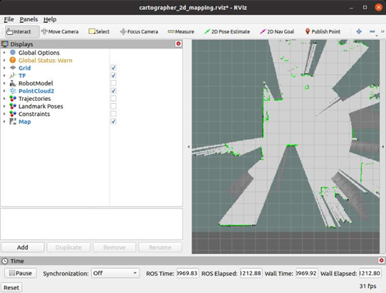

# 🧭 Cartographer 2D Mapping and Navigation

RobiS supports the **Cartographer** SLAM algorithm developed by Google. Cartographer offers higher mapping accuracy and integrated localization, but it requires more computational power.

---

## 🔧 Launch device driver
```
roslaunch robot_start robot_start.launch
```

## 🗺️ Start Cartographer 2-D SLAM (new terminal)
```
roslaunch robot_start carto_2d_mapping.launch
```
<p align="center">
   
   </p>

Drive the robot in manual mode until the map covers the whole area.

<p align="center">
   
   </p>

## 💾 Save the map (new terminal)
```
sh catkin_ws/src/robot_start/sh/save_map.sh
```
When finished, stop the Cartographer node: `Ctrl-C` in its terminal.

## 🧭 Launch navigation
```
roslaunch robot_start teb_navigation_slam.launch
```
After setting the initial pose with **2D Pose Estimate**, use **2D Nav Goal** to click any spot for point-to-point navigation (switch the remote to **PC-mode**).

<p align="center">
   
   </p>
<p align="center">
   
   </p>
---

Please refer to the accompanying video.

 <video controls width="600">
   <source src="../../imgs/p7.2D_cartographer_mapping&teb_navigation.mp4" type="video/mp4">
 </video>