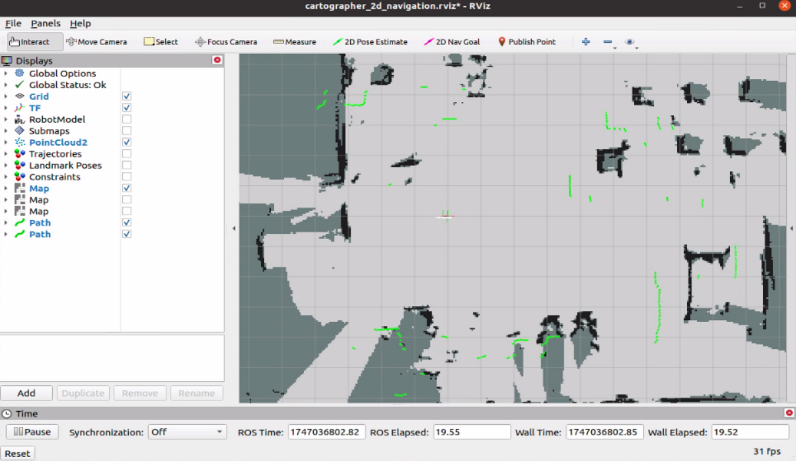

# 🧭 Cartographer 2D Mapping and Navigation

RobiS supports the **Cartographer** SLAM algorithm developed by Google, in addition to Karto, GMapping, and Hector SLAM. Cartographer offers higher mapping accuracy and integrated localization, but it requires more computational power.

---

## 🗺️ Cartographer 2D Mapping

### 🚀 Launch Cartographer SLAM

After activating the chassis, LiDAR, and IMU drivers, begin Cartographer mapping with:

```bash
roslaunch robot_start carto_2d_mapping.launch
```
   <p align="center">
   
   </p>
### 🖥️ Visualize in RViz

Open RViz to observe mapping progress:

- **White** = explored areas
- **Gray** = unknown regions
- **Black** = walls or obstacles
   <p align="center">
   
   </p>
Navigate the robot through the environment using the remote control to build a detailed map.

### 💾 Save the Map

Note: Cartographer mapping stops once a map is saved (unlike GMapping or Karto which allow continuation). To save the map:

```bash
sh ~/catkin_ws/src/robot_start/sh/save_map.sh
```

The map files are stored in:

```
~/catkin_ws/src/robot_start/map/
```

Files are named `map.*` (e.g., `map.pgm`, `map.yaml`), and can be backed up or reused.
   <p align="center">
   
   </p>
---

## 🧭 Cartographer Navigation

After saving the map, you can use it for navigation using Cartographer’s built-in localization.

### 🚀 Launch Navigation with Cartographer SLAM

Start Cartographer navigation using:

```bash
roslaunch robot_start teb_navigation_slam.launch
```
   <p align="center">
   
   </p>
This uses the `move_base` package for planning, but relies on Cartographer for localization (instead of AMCL).

### 🧭 Set Initial Pose in RViz

1. Click `2D Pose Estimate` in RViz.
2. Click and drag on the map where the robot starts, matching its real-world position and heading.
3. The LiDAR scan should overlap well with map features.
   <p align="center">
   
   </p>
### 🎯 Set a Navigation Goal

1. Use `2D Nav Goal` in RViz.
2. Click and drag to set a goal location and heading.
3. The robot will follow the path using TEB local planning and avoid obstacles dynamically.
   <p align="center">
   
   </p>
---

## ⚙️ Navigation Parameter Files

Parameters for `move_base` and Cartographer navigation are located in:

```
~/catkin_ws/src/robot_start/param/
```

| File Name                     | Purpose                                      |
|------------------------------|----------------------------------------------|
| `costmap_common_params.yaml` | Base configuration for costmaps              |
| `global_planner_params.yaml` | Dijkstra-based global path planner           |
| `local_costmap_params.yaml`  | Settings for local obstacle avoidance        |
| `move_base_params.yaml`      | Recovery behaviors and planners              |
| `teb_local_planner.yaml`     | TEB local planner configuration              |
| `dwa_local_planner.yaml`     | Alternative DWA planner config               |

> 🛠️ Adjust these configs for performance, speed, or safety constraints based on your environment and platform.

---

Once configured, Cartographer-based navigation can deliver precise, stable motion through complex mapped environments.