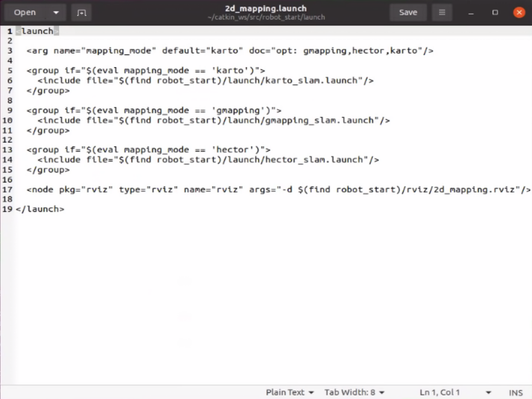

# 🗺️ 2D LiDAR Mapping

Once the chassis, LiDAR, and IMU drivers are active, you can begin performing 2D LiDAR-based mapping using one of several supported algorithms.

---

## 🧭 Supported Mapping Algorithms

RobiS supports three common SLAM algorithms:
- `karto`
- `gmapping`
- `hector`

You can configure the desired algorithm in the following launch file:
```
~/catkin_ws/src/robot_start/launch/2d_mapping.launch
```
   <p align="center">
   
   </p>
Find the following line and update the default:
```xml
<arg name="mapping_mode" default="karto" doc="opt: gmapping,hector,karto"/>
```

---

## 🚀 Launch Mapping Process

Start mapping using the selected algorithm:

```bash
roslaunch robot_start 2d_mapping.launch
```

Alternatively, specify the algorithm directly in the command line:

```bash
roslaunch robot_start 2d_mapping.launch mapping_mode:=karto
```

---

## 🖥️ Viewing the Map in RViz
Here is an example of using the Karto algorithm for mapping. The figure shows the normal running effect after the instruction starts the program:
   <p align="center">
   
   </p>
Once the process starts, open RViz to see real-time SLAM visualization. The color codes are:

- **White** – explored free space
- **Gray** – unknown areas
- **Black** – obstacles or walls
   <p align="center">
   
   </p>
Use the remote control to guide the robot around the environment. Make sure to cover key areas for a complete map.

---

## 💾 Save the Map

After mapping is complete, run the following command to save the generated map:

```bash
sh ~/catkin_ws/src/robot_start/sh/2d_save_map.sh
```

The saved map will be stored in:

```
~/catkin_ws/src/robot_start/map/
```

Maps are saved with the prefix `2d_map`. You can back them up or restore them later as needed.

   <p align="center">
   
   </p>

> 📌 Tip: Make sure the robot revisits boundaries and major corridors to improve loop closure and map consistency.