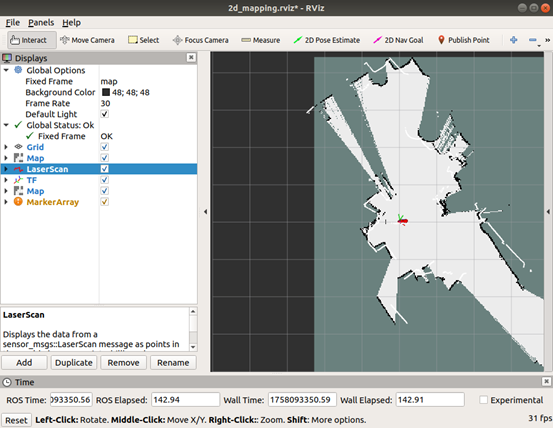
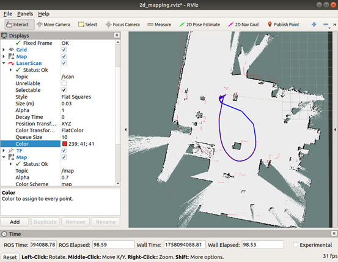

# 🧭 Karto 2D LiDAR Navigation


---

## 🔧 Launch device driver
```
roslaunch robot_start robot_start.launch
```

## 🗺️ Start Karto 2-D SLAM (new terminal)
```
roslaunch robot_start 2d_mapping.launch
```
<p align="center">
   
   </p>

Drive the robot in manual mode until the map covers the whole area.

<p align="center">
   
   </p>

## 💾 Save the map (new terminal)
```
sh catkin_ws/src/robot_start/sh/2d_save_map.sh
```
When finished, stop the Karto node: `Ctrl-C` in its terminal.

## 🧭 Launch navigation
```
roslaunch robot_start 2d_navigation.launch
```
After setting the initial pose with **2D Pose Estimate**, use **2D Nav Goal** to click any spot for point-to-point navigation (switch the remote to **PC-mode**).

<p align="center">
   
   </p>

<p align="center">
   
   </p>

---

Please refer to the accompanying video.

 <video controls width="600">
   <source src="../../imgs/p6.2D_karto_mapping&teb_navigation.mp4" type="video/mp4">
 </video>