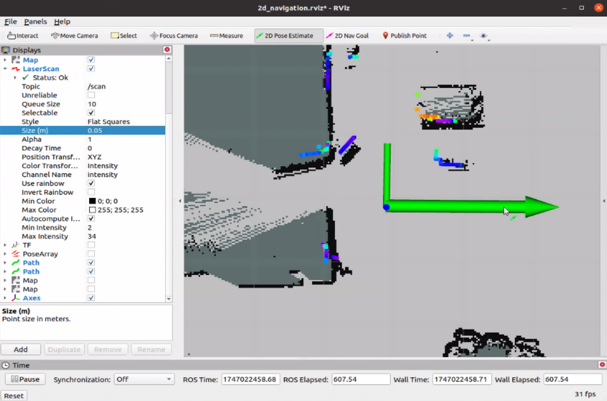

# 🧭 2D LiDAR Navigation

Once the chassis, LiDAR, and IMU drivers are running and a valid 2D LiDAR map has been saved, you can activate the 2D navigation function.

This system uses the open-source `move_base` package and includes the following key components:
- **AMCL** for localization
- **Dijkstra** for global path planning
- **TEB** for local trajectory generation and obstacle avoidance

---

## 🚀 Launch Navigation Stack

Run the following command in a new terminal:

```bash
roslaunch robot_start 2d_navigation.launch
```

This will initialize the `move_base` stack and all related navigation components.
   <p align="center">
   
   </p>
---

## 🖱️ Set Initial Pose in RViz

1. Open RViz
2. Click the `2D Pose Estimate` tool
3. Click and drag on the map to indicate the robot's current location and heading
4. Make sure the LiDAR scan (point cloud) aligns well with nearby map features
   <p align="center">
   
   </p>
---

## 🎯 Set Navigation Goal

1. Click the `2D Nav Goal` tool in RViz
2. Click and drag to specify the desired goal location and heading
3. The robot will begin moving toward the goal, avoiding obstacles automatically
   <p align="center">
   
   </p>
---

## 📊 Observe Path Planning

While navigating, you’ll see:
- **Planned path** overlaid on the map
- **Red arrows** indicating pose updates and stability
- **Dynamic costmaps** adjusting to obstacles

These visualizations help verify that navigation is proceeding correctly.

---

## ⚙️ Configuration Files

Navigation parameters are stored in:

```
~/catkin_ws/src/robot_start/param/
```

| File Name                     | Description                                 |
|------------------------------|---------------------------------------------|
| `costmap_common_params.yaml` | Shared costmap settings                     |
| `global_planner_params.yaml` | Global path planner settings (e.g. Dijkstra)|
| `local_costmap_params.yaml`  | Settings for the local costmap              |
| `move_base_params.yaml`      | Recovery behavior and controller configs    |
| `teb_local_planner.yaml`     | TEB-specific planning parameters            |
| `dwa_local_planner.yaml`     | Alternative local planner settings (DWA)    |

> 💡 Tweak these parameters to improve navigation quality for different environments or behaviors.

---

Once the robot reaches the goal, you can reissue new navigation targets or adjust maps and configurations as needed.