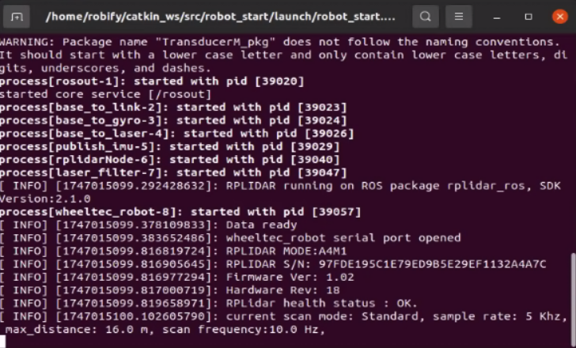

# 🛠️ Chassis and LiDAR Driver Startup

Before using other functions of the RobiS robot, it's necessary to activate essential hardware modules such as the chassis drive, LiDAR, and IMU.

---

## 🚀 Start All Core Drivers

To start all key drivers in one terminal, run the following command:

```bash
roslaunch robot_start robot_start.launch
```

If successful, the robot's chassis and sensors will initialize correctly and begin publishing data.
   <p align="center">
   
   </p>
---

## 🧩 Start Drivers Individually

If you need to start each component separately (e.g., for debugging or selective usage), use the following commands in separate terminals:

### 🔄 Chassis Drive Only

```bash
roslaunch car_control car_control.launch
```

### 📡 LiDAR Sensor Only

```bash
roslaunch rplidar_ros rplidar_c1.launch
```

### 🧭 IMU Sensor Only

```bash
roslaunch TransducerM_pkg imu.launch
```

> 💡 **Tip:** Use `rqt_graph` or `rostopic list` to verify whether nodes are running and topics are being published.

---

Once the drivers are active, you can proceed to 2D mapping, navigation, or autonomous operations.