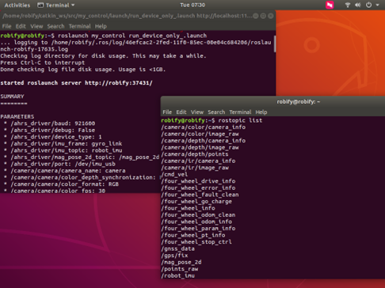
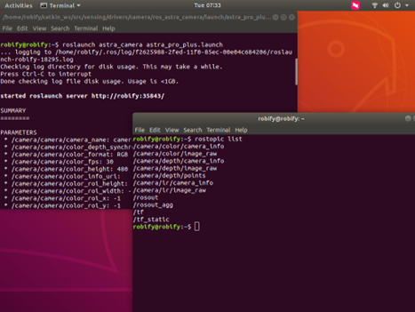
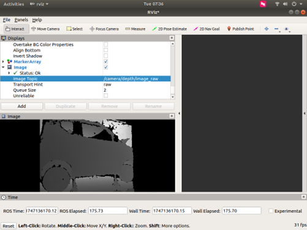
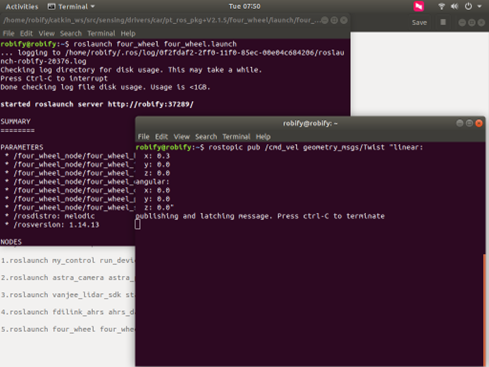

# 🛠️ Initialization of chassis and sensor drivers

Before using other functions of the RobiS robot, it's necessary to activate essential hardware modules such as the chassis drive, LiDAR, and IMU.

---

## 🔧 Starting the Chassis & Sensor Drivers

### 🚀 Bring up all chassis and sensor data

Open a new terminal and run:

```
roslaunch my_control run_device_only.launch
```

<p align="center">
   
   </p>

Verify the data stream:

```
rostopic echo /four_wheel_info
```

<p align="center">
   
   </p>

------

### 📷 Start the depth camera

New terminal:

```
roslaunch astra_camera astra_pro.launch
```

<p align="center">
   
   </p>

Visualise in RViz:

```
rviz
```

- Click **Add** → **By topic** → pick the camera image topic.

<p align="center">
   
   </p>

- In the image drop-down you can switch between depth, RGB or IR.

<p align="center">
   
   </p>

------

### 📡 Start the LiDAR

New terminal:

```
roslaunch vanjee_lidar_sdk start.launch
```

<p align="center">
   
   </p>

In RViz set the display **Type** to *XYOrbit* for a 3-D point-cloud view.

<p align="center">
   
   </p>

------

### 🧭 Start the IMU

New terminal:

```
roslaunch fdilink_ahrs ahrs_data.launch
```

<p align="center">
   
   </p>

Check the stream:

```
rostopic echo /robot_imu
```

<p align="center">
   
   </p>

------

### 🚗 Start the chassis node

New terminal:

```
roslaunch four_wheel four_wheel.launch
```

<p align="center">
   
   </p>

Send a motion command (example):

```
rostopic pub /cmd_vel geometry_msgs/Twist "linear:
  x: 0.2
  y: 0.0
  z: 0.0
angular:
  x: 0.0
  y: 0.0
  z: 0.0" -r 10
```

<p align="center">
   
   </p>
**⚠️ Before hitting ENTER**

- Confirm the remote is in **PC-mode** (SWB middle).
- Make sure the **red e-stop is released** (SWD down).

---

Please refer to the accompanying video.

 <video controls width="600">
   <source src="../../imgs/p2.chassis_imu_info.mp4" type="video/mp4">
 </video>
